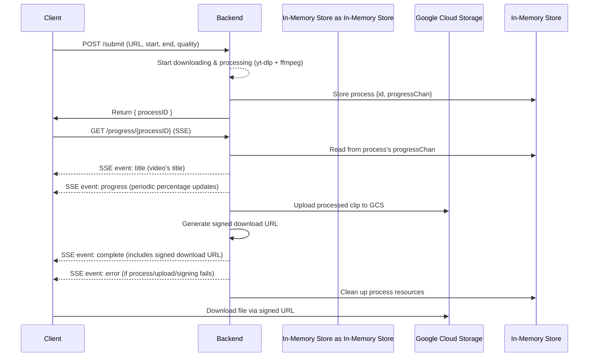

  <h1 >✂️ Video Clipper</h1>

  Free, fast, and simple tool to download only the parts you need from online videos.  
  No login, no watermark — just paste a link, set your range, and download.

  

  

## Table of Contents
- [Features](#features)
- [Tech Stack](#tech-stack)
- [System Workflow Diagram](#system-workflow-diagram)
- [Key Design Decisions](#key-design-decisions)
  - [Why `FFmpeg` is Used?](#why-ffmpeg-is-used)
  - [Why Google Cloud Storage (GCS) Instead of Local Disk?](#why-google-cloud-storage-gcs-instead-of-local-disk)
  - [Why Save Locally Before Uploading to GCS?](#why-save-locally-before-uploading-to-gcs)
  - [How `yt-dlp` Frequent Updates Are Handled](#how-yt-dlp-frequent-updates-are-handled)

## Features
- **Precise Clipping** -  Allows extraction of specific video segments by selecting start and end times.

- **Wide Platform Support** - Works with [1000+ video sites](https://github.com/yt-dlp/yt-dlp/blob/master/supportedsites.md)

- **Real-Time Progress** –  Displays live progress updates during the download process.  

- **Quality Selection** – Provides video quality options from 360p up to 2K.  

## Tech Stack

- **UI Design**: [Visily](https://www.visily.ai/)
- **Frontend**: AI-Generated (HTML/CSS/JS)
- **Backend**: Go
- **Video Processing**: [yt-dlp](https://github.com/yt-dlp/yt-dlp), [ffmpeg](https://ffmpeg.org/)
- **Real-time Communication**: Server-Sent Events (SSE)
- **Containerization**: Docker
- **Hosting**: Google Cloud Run
- **Data & Storage**:
  - Firestore (tracks created clips count)
  - Google Cloud Storage (stores and serves video files)
- **Analytics**: Google Analytics and Microsoft Clarity

## System Workflow Diagram

The following diagram illustrates the end-to-end flow, from client submission to file download.

## Key Design Decisions

### Why `FFmpeg` is Used?

While **`yt-dlp`** can handle the entire download-and-clip process by itself, the **progress information it exposes is limited**. Its `-progress` flag provides meaningful updates for full downloads, but when clipping, the output is too sparse to support real-time progress reporting to the client.  

> 💡 **Decision**: Use `yt-dlp` only for extracting and downloading the requested clip, and pipe its output into `ffmpeg`.

**`ffmpeg`** then:  
- Produces the final output file.  
- Exposes detailed progress data (e.g., current output duration).  

By comparing this duration against the requested clip length, the app can calculate and share **accurate real-time progress percentages** with the client.  

---

### Why Google Cloud Storage (GCS) Instead of Local Disk?

The main reason for switching from local disk to GCS was **to minimize costs**.  

Initially, the app was designed to **store clips directly on the local disk** of the Cloud Run instance and serve them from there. 

This worked fine at the start, but once traffic increased, it quickly hit the **1 GB/month free egress limit** (egress = data transferred out of Google’s network to clients). 

Switching to **Google Cloud Storage** solved this problem:  
- It comes with **100 GB/month of free egress**.  
- Lets clients download files directly via signed URLs, reducing backend bandwidth.  
- Simplifies file management and cleanup.

> *Fun fact: before moving to GCS, one user somehow managed to download 3 GB of clips in just 5 minutes.*    

---

### Why Save Locally Before Uploading to GCS?

Directly streaming `ffmpeg` output into GCS seemed like the cleanest design, but in practice it caused unreliable uploads (broken pipes, conversion failures, incomplete files).

The safer approach was to **write the file to disk first** and then upload it to GCS. This guaranteed that the uploaded clip was fully valid and avoided mid-stream corruption.

Because both Google Cloud Run and Google Cloud Storage are in the same region, the upload step is extremely fast. The data moves within Google’s internal network, so even large files transfer almost instantly.

---

### How `yt-dlp` Frequent Updates Are Handled?

`yt-dlp` updates often to adapt to changes on video platforms, and an outdated version can cause downloads to fail. To handle this:

- The **Dockerfile always downloads the latest** `yt-dlp` when building the container.

- The system includes a **function that manages `yt-dlp` updates**:
  - It **checks if a new `yt-dlp` version is available**.
  - If a new version is available, it **triggers a container rebuild**.

- This function is **called when a download fails (because it may have failed due to an outdated** `yt-dlp`).

- Also, there is a **public endpoint** `/check-ytdlp-update` that runs this function, which is called daily via [cron-job](https://cron-job.org/en/)

  > **Safety note**: Exposing this endpoint publicly is safe because **it only triggers a rebuild if a `yt-dlp` update is detected**, with no other side effects.

This setup ensures the **system automatically stays up-to-date with `yt-dlp`**, minimizing downtime caused by outdated versions.
