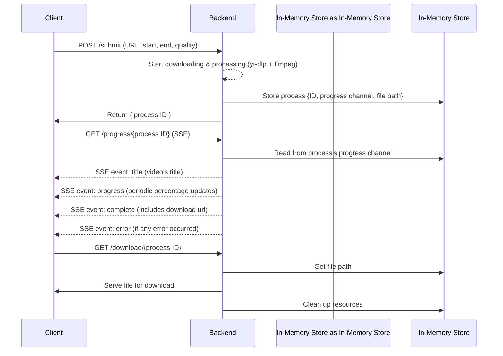

  <h1 >✂️ Video Clipper</h1>

  Free, fast, and simple tool to download only the parts you need from online videos.  
  No login, no watermark — just paste a link, set your range, and download.

  

  

## Table of Contents
- [Features](#features)
- [Tech Stack](#tech-stack)
- [System Workflow Diagram](#system-workflow-diagram)
- [Infrastructure & Scaling](#infrastructure--scaling)
- [Key Design Decisions](#key-design-decisions)
  - [Why `FFmpeg` is Used?](#why-ffmpeg-is-used)
  - [How `yt-dlp` Frequent Updates Are Handled](#how-yt-dlp-frequent-updates-are-handled)

## Features
- **Precise Clipping** -  Allows extraction of specific video segments by selecting start and end times.

- **Wide Platform Support** - Works with [1000+ video sites](https://github.com/yt-dlp/yt-dlp/blob/master/supportedsites.md)

- **Real-Time Progress** –  Displays live progress updates during the download process.  

- **Quality Selection** – Provides video quality options from 360p up to 2K.  

## Tech Stack

- **UI Design**: [Visily](https://www.visily.ai/)
- **Frontend**: AI-Generated (HTML/CSS/JS)
- **Backend**: Go
- **Video Processing**: [yt-dlp](https://github.com/yt-dlp/yt-dlp), [ffmpeg](https://ffmpeg.org/)
- **Real-time Communication**: Server-Sent Events (SSE)
- **Containerization**: Docker
- **Hosting**: Amazon EC2
- **Data Storage**: Firestore (tracks created clips count)
- **Analytics**: Google Analytics and Microsoft Clarity

## System Workflow Diagram

The following diagram illustrates the end-to-end flow, from client submission to file download.

## Infrastructure & Scaling

Since launching in **July 2025**, the app has gained users steadily, and the infrastructure evolved to handle increasing traffic while **minimizing costs by staying within free tier limits**.

### Phase 1 – Google Cloud Run
*Free tier: 50 CPU hours, 1 GB outbound data per month*  
 
The app initially ran on **Cloud Run** using autoscaling with a maximum of one instance, handling all tasks including downloading, serving, and cleaning up videos. This setup was sufficient for the first month’s traffic **(43 users)**.

As traffic increased in August **(246 users)**, data transfer grew significantly, **exceeding Cloud Run’s 1 GB outbound data limit** and leading to the transition to the next phase.

> **Note:** "Outbound data" refers to the amount of data sent from the server to users.

### Phase 2 – Cloud Run + Cloud Storage
*Free tier: Cloud Run (50 CPU hours, 1 GB outbound data) + Cloud Storage (100 GB outbound data) per month*  

To handle the increasing data transfer, **Cloud Storage was integrated alongside Cloud Run** to offload downloads and reduce bandwidth usage. The backend uploaded processed videos to Cloud Storage and returned their download URLs to clients, allowing them to download directly from Cloud Storage instead of through Cloud Run.

This setup took advantage of **Cloud Storage’s 100 GB of free outbound data**, which effectively handled bandwidth needs for September’s **942 users**. However, after 23 days, **CPU usage on Cloud Run exceeded the free tier limit**, prompting the transition to the next phase.

### Phase 3 – Amazon EC2
*Free tier: 750 hours, 100 GB outbound data per month*  

This is the **current phase of the project**. After exceeding Cloud Run’s CPU time limit, the backend was **migrated to Amazon EC2** to gain more control and avoid the execution time restrictions of serverless environments.  

**EC2 now handles all backend operations**, including downloading, processing, serving, and cleanup, providing **stable performance for 616 users** during the first week of October.

## Key Design Decisions

### Why `FFmpeg` is Used?

While `yt-dlp` can handle the entire download and clip process, the **progress information it exposes is limited**. Its `--progress` flag provides meaningful updates for full downloads, but during clipping, the output isn’t sufficient to support real-time client updates.

To address this, the app uses `yt-dlp` only for **extracting and downloading** the requested clip and then **pipes its output to `ffmpeg`**.

`ffmpeg` then:
- Produces the final output file.  
- Exposes detailed progress data (e.g., current output duration).  

By comparing this duration against the requested clip length, the app calculates and shares **accurate real-time progress percentages** with the client.

---

### How `yt-dlp` Frequent Updates Are Handled?

`yt-dlp` updates often to adapt to changes on video platforms, and an outdated version can cause downloads to fail. To handle this:

- The **Dockerfile always downloads the latest** `yt-dlp` when building the container.

- The system includes a **function responsible for managing `yt-dlp` updates**:
  - It **checks if a newer version is available**, and if so, **installs the update** to keep the local `yt-dlp` version updated.
  - It is **called after each failed download**, since a failure might be caused by an outdated version.
  - It is also **executed daily through an internal ticker**, ensuring regular updates even when no failures occur.

This setup ensures the **system automatically stays up-to-date with `yt-dlp`**, minimizing downtime caused by outdated versions.
